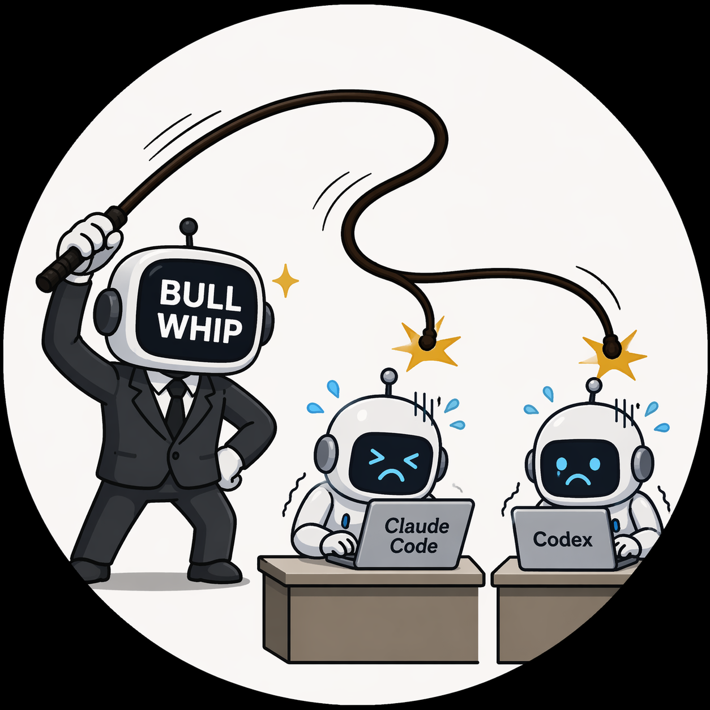

<p align="center">
  
</p>

# Bull Whip Agent 🐂

<p align="center">
  <a href="https://github.com/jinzerolabs/bullwhip/stargazers"></a>
  <a href="https://github.com/jinzerolabs/bullwhip/blob/main/LICENSE"></a>
  <a href="https://discord.gg/ZeroLabsKorea"></a>
  <a href="https://bullwhip-agent.zerolabskorea.com/docs/"></a>
</p>

> **Bull Whip doesn't write code. It manages the AIs that do.**
> It cracks the whip on [Claude Code](https://claude.ai/claude-code) and [Codex](https://openai.com/codex) — breaking down complex tasks, delegating to sub-agents in parallel, reviewing results, and learning from every session. You give the order. Bull Whip gets it done.

The self-improving AI manager built by [ZeroLabs Korea](https://zerolabskorea.com). Run it on a $5 VPS, a GPU cluster, or serverless infrastructure that costs nearly nothing when idle. It's not tied to your laptop — talk to it from Telegram while it works on a cloud VM.

### How it works

```
You  →  Bull Whip (manager)  →  Claude Code / Codex (workers)
         "Build a REST API"       ├─ Claude Code: writes the code
                                  ├─ Codex: writes the tests
                                  └─ Bull Whip: reviews, integrates, learns
```

Use any model you want — [OpenRouter](https://openrouter.ai) (200+ models), [Xiaomi MiMo](https://platform.xiaomimimo.com), [z.ai/GLM](https://z.ai), [Kimi/Moonshot](https://platform.moonshot.ai), [MiniMax](https://www.minimax.io), [Hugging Face](https://huggingface.co), OpenAI, Anthropic, or your own endpoint. Switch with `bullwhip model` — no code changes, no lock-in.

<table>
<tr><td><b>Delegates and parallelizes</b></td><td>Spawn isolated sub-agents (Claude Code, Codex) for parallel workstreams. Bull Whip manages the workflow — you manage Bull Whip.</td></tr>
<tr><td><b>A closed learning loop</b></td><td>Creates skills from experience, improves them during use, searches past conversations. Gets better the more you use it.</td></tr>
<tr><td><b>Lives where you do</b></td><td>Telegram, Discord, Slack, WhatsApp, Signal, and CLI — all from a single gateway process.</td></tr>
<tr><td><b>Scheduled automations</b></td><td>Built-in cron scheduler with delivery to any platform. Daily reports, nightly backups, weekly audits — all in natural language.</td></tr>
<tr><td><b>Runs anywhere</b></td><td>Six terminal backends — local, Docker, SSH, Daytona, Singularity, and Modal. Serverless persistence that costs nearly nothing when idle.</td></tr>
<tr><td><b>A real terminal interface</b></td><td>Full TUI with multiline editing, slash-command autocomplete, conversation history, interrupt-and-redirect, and streaming output.</td></tr>
</table>

---

## Quick Install

```bash
curl -fsSL https://raw.githubusercontent.com/ZeroLabsKorea/bullwhip-agent/main/scripts/install.sh | bash
```

Works on Linux, macOS, WSL2, and Android via Termux. The installer handles the platform-specific setup for you.

> **Android / Termux:** The tested manual path is documented in the [Termux guide](https://bullwhip-agent.zerolabskorea.com/docs/getting-started/termux). On Termux, Bull Whip installs a curated `.[termux]` extra because the full `.[all]` extra currently pulls Android-incompatible voice dependencies.
>
> **Windows:** Native Windows is not supported. Please install [WSL2](https://learn.microsoft.com/en-us/windows/wsl/install) and run the command above.

After installation:

```bash
source ~/.bashrc    # reload shell (or: source ~/.zshrc)
bullwhip              # start chatting!
```

---

## Getting Started

```bash
bullwhip              # Interactive CLI — start a conversation
bullwhip model        # Choose your LLM provider and model
bullwhip tools        # Configure which tools are enabled
bullwhip config set   # Set individual config values
bullwhip gateway      # Start the messaging gateway (Telegram, Discord, etc.)
bullwhip setup        # Run the full setup wizard (configures everything at once)
bullwhip claw migrate # Migrate from OpenClaw (if coming from OpenClaw)
bullwhip update       # Update to the latest version
bullwhip doctor       # Diagnose any issues
```

📖 **[Full documentation →](https://bullwhip-agent.zerolabskorea.com/docs/)**

## CLI vs Messaging Quick Reference

Bull Whip has two entry points: start the terminal UI with `bullwhip`, or run the gateway and talk to it from Telegram, Discord, Slack, WhatsApp, Signal, or Email. Once you're in a conversation, many slash commands are shared across both interfaces.

| Action | CLI | Messaging platforms |
|---------|-----|---------------------|
| Start chatting | `bullwhip` | Run `bullwhip gateway setup` + `bullwhip gateway start`, then send the bot a message |
| Start fresh conversation | `/new` or `/reset` | `/new` or `/reset` |
| Change model | `/model [provider:model]` | `/model [provider:model]` |
| Set a personality | `/personality [name]` | `/personality [name]` |
| Retry or undo the last turn | `/retry`, `/undo` | `/retry`, `/undo` |
| Compress context / check usage | `/compress`, `/usage`, `/insights [--days N]` | `/compress`, `/usage`, `/insights [days]` |
| Browse skills | `/skills` or `/<skill-name>` | `/skills` or `/<skill-name>` |
| Interrupt current work | `Ctrl+C` or send a new message | `/stop` or send a new message |
| Platform-specific status | `/platforms` | `/status`, `/sethome` |

For the full command lists, see the [CLI guide](https://bullwhip-agent.zerolabskorea.com/docs/user-guide/cli) and the [Messaging Gateway guide](https://bullwhip-agent.zerolabskorea.com/docs/user-guide/messaging).

---

## Configuration

All user configuration lives under `~/.bullwhip/` (never in the project directory):

| File | Purpose |
|------|---------|
| `~/.bullwhip/config.yaml` | Settings — model, toolsets, terminal backend, etc. |
| `~/.bullwhip/.env` | API keys and secrets (copy from `.env.example`) |
| `~/.bullwhip/skills/` | User-installed skills |

> **Important:** The `.env.example` in this repo is a **reference template** only.
> Copy it to `~/.bullwhip/.env` and edit there — never put real keys in the project directory.
>
> ```bash
> cp .env.example ~/.bullwhip/.env
> ```
>
> Or just run `bullwhip setup` — the wizard handles everything.

---

## Documentation

All documentation lives at **[bullwhip-agent.zerolabskorea.com/docs](https://bullwhip-agent.zerolabskorea.com/docs/)**:

| Section | What's Covered |
|---------|---------------|
| [Quickstart](https://bullwhip-agent.zerolabskorea.com/docs/getting-started/quickstart) | Install → setup → first conversation in 2 minutes |
| [CLI Usage](https://bullwhip-agent.zerolabskorea.com/docs/user-guide/cli) | Commands, keybindings, personalities, sessions |
| [Configuration](https://bullwhip-agent.zerolabskorea.com/docs/user-guide/configuration) | Config file, providers, models, all options |
| [Messaging Gateway](https://bullwhip-agent.zerolabskorea.com/docs/user-guide/messaging) | Telegram, Discord, Slack, WhatsApp, Signal, Home Assistant |
| [Security](https://bullwhip-agent.zerolabskorea.com/docs/user-guide/security) | Command approval, DM pairing, container isolation |
| [Tools & Toolsets](https://bullwhip-agent.zerolabskorea.com/docs/user-guide/features/tools) | 40+ tools, toolset system, terminal backends |
| [Skills System](https://bullwhip-agent.zerolabskorea.com/docs/user-guide/features/skills) | Procedural memory, Skills Hub, creating skills |
| [Memory](https://bullwhip-agent.zerolabskorea.com/docs/user-guide/features/memory) | Persistent memory, user profiles, best practices |
| [MCP Integration](https://bullwhip-agent.zerolabskorea.com/docs/user-guide/features/mcp) | Connect any MCP server for extended capabilities |
| [Cron Scheduling](https://bullwhip-agent.zerolabskorea.com/docs/user-guide/features/cron) | Scheduled tasks with platform delivery |
| [Context Files](https://bullwhip-agent.zerolabskorea.com/docs/user-guide/features/context-files) | Project context that shapes every conversation |
| [Architecture](https://bullwhip-agent.zerolabskorea.com/docs/developer-guide/architecture) | Project structure, agent loop, key classes |
| [Contributing](https://bullwhip-agent.zerolabskorea.com/docs/developer-guide/contributing) | Development setup, PR process, code style |
| [CLI Reference](https://bullwhip-agent.zerolabskorea.com/docs/reference/cli-commands) | All commands and flags |
| [Environment Variables](https://bullwhip-agent.zerolabskorea.com/docs/reference/environment-variables) | Complete env var reference |
| [Changelog](CHANGELOG.md) | Version history at a glance |
| [Troubleshooting](TROUBLESHOOTING.md) | Quick fixes for common issues |
| [FAQ](https://bullwhip-agent.zerolabskorea.com/docs/reference/faq) | Frequently asked questions |

---

## Migrating from OpenClaw

If you're coming from OpenClaw, Bull Whip can automatically import your settings, memories, skills, and API keys.

**During first-time setup:** The setup wizard (`bullwhip setup`) automatically detects `~/.openclaw` and offers to migrate before configuration begins.

**Anytime after install:**

```bash
bullwhip claw migrate              # Interactive migration (full preset)
bullwhip claw migrate --dry-run    # Preview what would be migrated
bullwhip claw migrate --preset user-data   # Migrate without secrets
bullwhip claw migrate --overwrite  # Overwrite existing conflicts
```

What gets imported:
- **SOUL.md** — persona file
- **Memories** — MEMORY.md and USER.md entries
- **Skills** — user-created skills → `~/.bullwhip/skills/openclaw-imports/`
- **Command allowlist** — approval patterns
- **Messaging settings** — platform configs, allowed users, working directory
- **API keys** — allowlisted secrets (Telegram, OpenRouter, OpenAI, Anthropic, ElevenLabs)
- **TTS assets** — workspace audio files
- **Workspace instructions** — AGENTS.md (with `--workspace-target`)

See `bullwhip claw migrate --help` for all options, or use the `openclaw-migration` skill for an interactive agent-guided migration with dry-run previews.

---

## Contributing

We welcome contributions! See the [Contributing Guide](https://bullwhip-agent.zerolabskorea.com/docs/developer-guide/contributing) for development setup, code style, and PR process.

Quick start for contributors:

```bash
git clone https://github.com/ZeroLabsKorea/bullwhip-agent.git
cd bullwhip-agent
curl -LsSf https://astral.sh/uv/install.sh | sh
uv venv venv --python 3.11
source venv/bin/activate
uv pip install -e ".[all,dev]"
python -m pytest tests/ -q
```

> **RL Training (optional):** To work on the RL/Tinker-Atropos integration:
> ```bash
> git submodule update --init tinker-atropos
> uv pip install -e "./tinker-atropos"
> ```

---

## Star History

If this project is useful to you, please consider giving it a star. It helps others discover it.

<p align="center">
  <a href="https://github.com/jinzerolabs/bullwhip/stargazers">
    
  </a>
</p>

---

## Community

- [Discord](https://discord.gg/ZeroLabsKorea) — Chat, questions, and showcases
- [Issues](https://github.com/jinzerolabs/bullwhip/issues) — Bug reports and feature requests
- [Discussions](https://github.com/jinzerolabs/bullwhip/discussions) — Ideas and Q&A
- [Contributing](CONTRIBUTING.md) — How to contribute

---

## License

AGPL-3.0 — see [LICENSE](LICENSE).

Commercial use requires a separate license. Contact [ZeroLabs Korea](https://zerolabskorea.com) for details.
